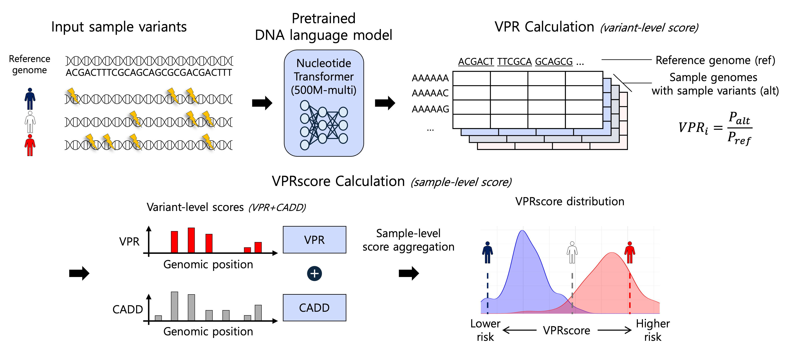

# VPRscore
A lightweight framework for estimating sample-level risk scores leveraging LLM-driven variant effects.

---

## Overview
VPRscore estimates the functional impact of genetic variants by comparing the **sequence-context probability** of reference vs. alternate alleles using a pretrained DNA language model (Nucleotide Transformer).

Variant-level signals are combined with CADD annotations and aggregated to produce a **sample-level VPRscore**.



---

## Installation

```bash
git clone https://github.com/ykosysbiolab/VPRscore.git
cd VPRscore/env/

#Using conda
conda env create -f environment.yml       # replace with your YAML file name if different
conda activate vprscore                   # use the name defined in the YAML

#Using pip
pip install -r requirements.txt
```

## Input Requirements

### Required

- VCF file with variants
  - single-sample or multi-sample VCF depending on the workflow:  
    - Two-step (multi-sample) mode: a merged multi-sample VCF containing all variants across samples
    - One-step (single-sample) mode: a per-sample VCF.
  - VCFs should be normalized to biallelic sites
    ```
    bcftools norm -m -both input.vcf.gz -Oz -o input.biallelic.vcf.gz
    bcftools index input.biallelic.vcf.gz
    ```
  - Must be on the same reference build as the FASTA and CADD
    
- Reference genome FASTA 
  - e.g., GRCh38.fa
  - Indexed with samtools faidx
 
- CADD tsv.gz (for annotation integration)
  - Download from the official CADD website: https://cadd.gs.washington.edu/download
  - Use the file matching your genome build (e.g. "All possible SNVs of GRCh38/hg38" for hg38) 

- Target region BED file
  - Genomic intervals where VPRscore should be computed (e.g. candidate diseases genes, exome panel, or GWAS loci).
  - Using a region file is strongly recommended: running over the entire genome is computationally expensive for large VCFs.

## Usage

### Recommended: 2-step workflow (multi-sample mode)

In the recommended workflow, VPRscore is computed in two stages:

1. Step 1 – Variant-level VPR
   Compute VPR (and variant-level scores) once for all variants in a merged multi-sample VCF.

2. Step 2 – Sample-level VPRscore
   Reuse the variant-level scores together with genotypes to aggregate sample-level VPRscores.

This avoids recomputing the Nucleotide Transformer output for the same variant across many samples.

  #### Step 1: Compute variant-level VPR
  
  ```bash
  python src/calculate_variant_vpr.py \
    --vcf data/merged.biallelic.vcf.gz \
    --fasta data/GRCh38.fa \
    --regions data/regions.bed \
    --cadd data/cadd_preprocessed.tsv.gz \
    --out results/variants_vpr.tsv
  ```
  #### Step 2: Compute sample-level VPRscore
  ```bash
  python src/compute_sample_vprscore.py \
    --vcf data/merged.biallelic.vcf.gz \
    --variant-vpr results/variants_vpr.tsv \
    --out results/sample_vprscore.tsv \
    --alpha 0.5 \
    --beta 0.2
  ```

### 2.2 Alternative: one-step workflow (single-sample mode)
For small datasets or quick testing, VPRscore can also be computed directly from a single-sample VCF in one step. In this mode, the script computes variant-level VPR and immediately aggregates a VPRscore for that sample.
  ```bash
  python src/run_single_sample_vprscore.py \
    --vcf data/sample1.biallelic.vcf.gz \
    --fasta data/GRCh38.fa \
    --regions data/regions.bed \
    --cadd data/cadd_preprocessed.tsv.gz \
    --sample-id sample1 \
    --out results/sample1_variants_vpr.tsv \
    --beta 0.2
  
  ```

## Inputs / Output

### Inputs
- `--vcf` : Biallelic VCF for a single sample.
- `--fasta` : Reference genome FASTA
- `--regions` : BED file with target regions
- `--cadd` : Preprocessed CADD table.
- `--alpha` : Variant-level weight for combining sequence-based risk and CADD. (alpha weight for vpr, default=0.5)
- `--beta` : Scaling parameter controlling variant-count weighting. (larger beta increases variant-count weighting, default=0.2)

### Output
- `variants_vpr.tsv` : per-variant vpr score from step 1 of 2-step workflow
- `VPRscore.tsv` : per-sample VPRscore results

---

#### Contact
For questions or issues:
- p3159@konkuk.ac.kr
